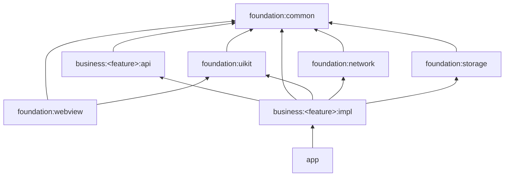

# SmartWallet 项目架构与开发规范指南

欢迎参与 SmartWallet 开发。本指南用于统一项目架构、模块职责、依赖方向和日常开发方式。新增模块或修改公共能力前，应先确认设计符合本文约束。

## 1. 文档适用范围

SmartWallet 是个人财务管理 Android 应用，采用：

- Android 组件化、模块化架构；
- MVVM 设计模式；
- App、Business、Foundation 三层结构；
- ARouter 统一路由；
- Gradle Version Catalog 统一管理依赖版本。

本文描述项目的目标规范。仓库中仍处于脚手架阶段的能力会明确标记为“待建设”，不得在其落地前假设相关 API 已存在。

## 2. 开发环境与版本基线

### 2.1 目标规范

| 项目 | 规范版本 |
| --- | --- |
| Android Studio | Giraffe 或更高版本，推荐使用最新稳定版 |
| JDK | 17 |
| Kotlin | 1.9.0 |
| Android Gradle Plugin | 8.0.2 |
| compileSdk | 34 |
| targetSdk | 34 |
| minSdk | 26 |
| AndroidX | 启用 |

### 2.2 当前仓库状态

截至本文建立时，仓库实际配置如下：

| 项目 | 当前值 | 与目标规范 |
| --- | --- | --- |
| JDK/sourceCompatibility | 11 | 待统一升级 |
| Kotlin | 2.0.21 | 与目标版本不同 |
| Android Gradle Plugin | 8.13.2 | 与目标版本不同 |
| compileSdk | 36 | 与目标版本不同 |
| targetSdk | 36 | 与目标版本不同 |
| minSdk | 24 | 与目标版本不同 |
| AndroidX | 已启用 | 符合 |

开发、CI 和发布必须使用同一套版本。版本未统一前，以仓库中的 `gradle/libs.versions.toml` 和各模块 `build.gradle.kts` 为构建事实，不得仅修改本文档或仅修改本地 IDE 配置。

## 3. 环境自动化

项目规划使用以下跨平台脚本：

- macOS/Linux：`./setup_env.sh`
- Windows：`setup_env.bat`

脚本应负责：

1. 检查 JDK 版本；
2. 检查 `ANDROID_HOME`；
3. 执行 `git config core.hooksPath .githooks`；
4. 在缺少 `local.properties` 时，根据 Android SDK 环境变量生成配置；
5. 输出明确的成功或失败信息。

> 当前仓库尚未提供 `setup_env.sh`、`setup_env.bat` 和对应 Git Hooks。脚本正式加入仓库前，新成员需要手动检查环境，文档中不得声称脚本已经可用。

## 4. 整体架构

工程自下而上分为 Foundation、Business 和 App 三层：



箭头表示“依赖”。依赖只能从上层指向下层，Foundation 不得依赖 Business 或 App。

## 5. Foundation 层

Foundation 提供与具体财务业务无关的通用技术能力，所有 Business 模块均可按需依赖。

### 5.1 `foundation:common`

职责：

- Application、Activity、Fragment 等基础环境封装；
- 日志、线程、图片、权限等通用工具；
- ARouter 等全局通用能力入口；
- 不包含账单、预算、统计等业务逻辑。

当前状态：

- 已存在 `BaseApplication` 和部分工具类；
- `BaseActivity`、`BaseFragment` 等能力仍待建设。

### 5.2 `foundation:uikit`

职责：

- 通用自定义 View；
- RecyclerView、ViewBinding 的公共 UI 封装；
- `BaseBindingAdapter`；
- BRVAH 等 UI 强相关第三方依赖。

不得包含任何业务模块专属页面或文案。

### 5.3 `foundation:network`

职责：

- Retrofit、OkHttp、RxJava 的统一配置；
- API 服务、拦截器、超时、证书及错误转换；
- 提供统一网络请求入口。

业务模块不得自行创建新的 Retrofit 或 OkHttp 全局实例。

### 5.4 `foundation:storage`

职责：

- MMKV 键值存储；
- Room 数据库及 DAO 基础设施；
- 数据库迁移和统一存储入口。

业务表、业务 DAO 的归属应经过评审；不得把 UI 或业务流程写入该模块。

### 5.5 `foundation:webview`

职责：

- 通用 WebView 容器；
- WebView 安全配置、生命周期和加载策略；
- 通用网页打开能力。

该模块可依赖 `foundation:common` 和 `foundation:uikit`，不得依赖任何 Business 模块。

## 6. Business 层

Business 根据产品功能拆分，每个业务组件必须包含独立的 `api` 和 `impl` Android Library 子模块。

当前业务组件：

| 组件 | 职责 |
| --- | --- |
| `business:home` | 应用首页和财务概览入口 |
| `business:bill` | 收支账单管理 |
| `business:statistics` | 财务统计与分析 |
| `business:budget` | 预算管理 |
| `business:profile` | 用户资料、偏好与设置 |

### 6.1 API 子模块

`business:<feature>:api` 只用于暴露：

- 跨模块服务接口；
- 跨模块必须共享的数据模型；
- 路由路径常量；
- ARouter `IProvider` 服务契约。

API 模块必须保持轻量，不得包含 Activity、Fragment、ViewModel、Repository 实现或具体 UI。

### 6.2 Impl 子模块

`business:<feature>:impl` 包含业务实现和 UI，并依赖自己的 API 子模块。源码包固定为：

```text
business/<feature>/impl/src/main/java/com/<feature>/
├── data/
├── ui/
└── viewmodel/
```

各包职责：

- `data`：数据源、Repository 实现、DTO 及数据转换；
- `ui`：Activity、Fragment、Adapter 和页面相关 UI；
- `viewmodel`：ViewModel、UI State 和 UI Event。

不得额外增加无明确职责的嵌套层级。确需调整结构时，应先更新本规范并统一所有业务组件。

## 7. App 层

`app` 是最终应用壳，职责包括：

- 装配所有 `business:<feature>:impl`；
- 提供应用入口；
- 执行 ARouter、MMKV、网络和数据库等全局初始化；
- 管理构建变体、签名、渠道和全局主题。

App 层不得承载具体业务流程。业务页面和业务逻辑必须放入对应 Business 模块。

## 8. 模块依赖规则

以下规则为强制规则：

1. `foundation` 绝对不能依赖 `business` 或 `app`。
2. `business:A:impl` 绝对不能依赖 `business:B:impl`。
3. 跨业务组件通信只能依赖目标组件的 `api`。
4. 每个 `impl` 必须依赖自己的 `api`，且使用 `implementation` 防止实现泄漏。
5. `app` 使用 `implementation` 装配所有业务 `impl`。
6. 只声明实际需要的依赖，禁止为了方便让所有模块互相可见。

允许：

```kotlin
// business:home:impl
implementation(project(":business:home:api"))
implementation(project(":business:bill:api"))
implementation(project(":foundation:common"))
```

禁止：

```kotlin
// foundation 层反向依赖业务层
implementation(project(":business:home:api"))

// 业务实现层直接依赖另一业务实现层
implementation(project(":business:bill:impl"))
```

根 Gradle 已配置项目依赖检查。检测到 `foundation → business` 或跨业务 `impl → impl` 等非法关系时，构建必须直接失败。

## 9. ARouter 路由规范

所有 Activity 之间的跨模块跳转必须使用 ARouter，禁止显式 Intent：

```kotlin
ARouter.getInstance()
    .build("/bill/detail")
    .navigation()
```

禁止：

```kotlin
startActivity(Intent(this, BillDetailActivity::class.java))
```

路由要求：

- 路径格式统一为 `/<module>/<page-or-service>`；
- 页面和服务实现放在 `impl`；
- 跨模块服务接口放在 `api` 并继承 `IProvider`；
- `impl` 必须配置 `kapt(libs.arouter.compiler)`；
- 路由路径不得以散落字符串形式重复定义；
- 修改公共路由契约时必须评估所有调用方。

## 10. 新增业务组件

以下以 `account` 组件为例。

### 10.1 创建目录

```text
business/account/
├── api/
│   └── src/main/java/com/account/api/
└── impl/
    └── src/main/java/com/account/
        ├── data/
        ├── ui/
        └── viewmodel/
```

### 10.2 配置 API 模块

```kotlin
plugins {
    alias(libs.plugins.android.library)
    alias(libs.plugins.kotlin.android)
}

android {
    namespace = "com.account.api"
}

dependencies {
    api(libs.arouter.api)
}
```

### 10.3 配置 Impl 模块

```kotlin
plugins {
    alias(libs.plugins.android.library)
    alias(libs.plugins.kotlin.android)
    alias(libs.plugins.kotlin.kapt)
}

android {
    namespace = "com.account.impl"

    buildFeatures {
        viewBinding = true
    }
}

dependencies {
    implementation(project(":business:account:api"))
    implementation(project(":foundation:common"))
    kapt(libs.arouter.compiler)
}
```

### 10.4 注册模块

在 `settings.gradle.kts` 中添加：

```kotlin
include(":business:account:api")
include(":business:account:impl")
```

### 10.5 装配实现

在 `app/build.gradle.kts` 中添加：

```kotlin
implementation(project(":business:account:impl"))
```

### 10.6 定义跨模块服务

1. 在 `account:api` 定义继承 `IProvider` 的接口；
2. 在 `account:impl` 实现该接口；
3. 在实现类上添加 `@Route`；
4. 调用方只能依赖 `account:api`；
5. 调用方通过 ARouter 获取服务，不得引用实现类。

## 11. UI 与 MVVM 规范

### 11.1 Activity 和 Fragment

- Activity 必须继承统一的 `BaseActivity<VB>`；
- Fragment 必须继承统一的 `BaseFragment<VB>`；
- 业务 Impl 模块必须开启 ViewBinding；
- 禁止使用 `findViewById`；
- Activity/Fragment 只负责渲染状态和转发用户事件；
- 业务计算不得放入 Activity、Fragment 或 Adapter。

> `BaseActivity`、`BaseFragment` 当前尚未在仓库中实现。本规则在基类落地后强制执行；落地前不得在各业务模块创建互不兼容的临时基类。

### 11.2 ViewModel

- ViewModel 不得持有 Activity、Fragment 或 View 引用；
- UI 状态通过可观察状态向页面暴露；
- 页面事件和一次性事件应与持久 UI 状态区分；
- 异步任务应绑定 ViewModel 生命周期；
- ViewModel 不得直接操作 View 或进行页面跳转。

### 11.3 ViewBinding

- 每个含 UI 的 `impl` 模块必须设置 `buildFeatures { viewBinding = true }`；
- Binding 对象不得传入 ViewModel 或数据层；
- Fragment 必须在 `onDestroyView` 后释放 Binding 引用。

### 11.4 状态栏与布局

统一基类完成沉浸式透明状态栏配置后，需要避让系统栏的 XML 根布局应设置：

```xml
android:fitsSystemWindows="true"
```

如页面采用 WindowInsets 方案，则不得同时重复消费 Insets。

## 12. 数据、网络与存储规范

### 12.1 网络

- 统一使用 `foundation:network` 提供的请求入口；
- 禁止业务模块自行维护 Retrofit/OkHttp 单例；
- 鉴权、日志、超时、错误转换统一在 Network 层处理；
- DTO 与 UI Model 不得混用；
- 网络错误必须转换为可处理的应用错误。

当前 `NetworkManager`、`ApiService` 等具体封装尚未实现，正式 API 以未来 `foundation:network` 落地内容为准。

### 12.2 存储

- 键值数据统一通过 `foundation:storage` 的 MMKV 封装；
- 结构化数据统一通过 Room；
- 禁止业务模块直接初始化 MMKV 或 Room；
- 数据库升级必须提供 Migration；
- 敏感财务数据不得明文记录到日志。

当前存储模块仅完成依赖与框架搭建，具体入口尚未实现。

## 13. 依赖与构建规范

- 所有第三方依赖版本统一写入 `gradle/libs.versions.toml`；
- 模块 `build.gradle.kts` 中禁止写死第三方版本号；
- 优先使用 `implementation`，仅在确实需要向调用方暴露类型时使用 `api`；
- 注解处理器使用统一的 Version Catalog 别名；
- 新增仓库地址必须说明用途并经过评审；
- 不得引入功能重复的第三方库；
- 修改依赖后至少执行受影响模块的 `assembleDebug`。

## 14. 命名规范

- 包名：`com.<module>`；
- API namespace：`com.<module>.api`；
- Impl namespace：`com.<module>.impl`；
- Activity：`XxxActivity`；
- Fragment：`XxxFragment`；
- ViewModel：`XxxViewModel`；
- UI 状态：`XxxUiState`；
- Repository 接口和实现：`XxxRepository`、`XxxRepositoryImpl`；
- ARouter 路径：`/<module>/<target>`；
- 资源名称必须增加模块前缀，例如 `bill_activity_detail`、`budget_ic_warning`。

## 15. 提交前检查

提交代码前至少确认：

- [ ] 没有 `foundation → business` 依赖；
- [ ] 没有跨业务 `impl → impl` 依赖；
- [ ] 跨模块调用只依赖目标 API；
- [ ] Activity 跳转使用 ARouter；
- [ ] 第三方版本位于 Version Catalog；
- [ ] UI 模块已启用 ViewBinding；
- [ ] 没有在 ViewModel 中持有 View 或 Context；
- [ ] 没有输出敏感财务数据；
- [ ] 受影响模块构建通过；
- [ ] 新增公共接口附有必要说明；
- [ ] 文档与实际配置保持一致。

## 16. 当前待建设事项

以下内容在规范中已有明确方向，但当前仓库尚未完成：

1. JDK、Kotlin、AGP 和 SDK 版本统一；
2. `setup_env.sh` 与 `setup_env.bat`；
3. Git Hooks；
4. `BaseActivity` 与 `BaseFragment`；
5. Foundation Network 具体封装；
6. Foundation Storage 具体封装；
7. Foundation UIKit 具体组件；
8. Foundation WebView 具体容器；
9. 各 Business 模块的 API 与业务实现；
10. CI 中的依赖规则和构建检查。

完成待建设项时，应同步更新本文档，禁止让规范与实际代码长期不一致。
